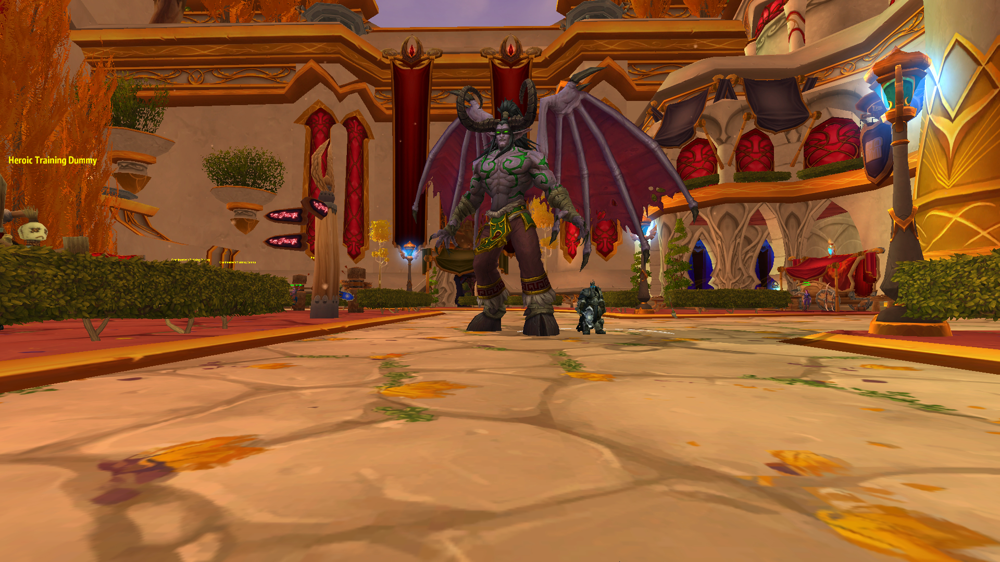
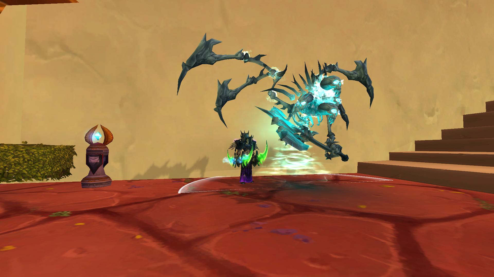
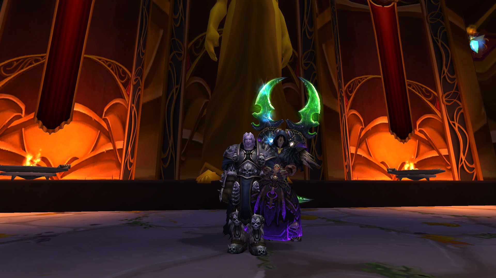

# Transmorpher

Transmorpher is a **client-side transmogrification system** for **World of Warcraft: Wrath of the Lich King (3.3.5a)** based on morphing.

The addon allows players to locally modify their visual appearance without affecting gameplay or server-side data. Visual changes are client-side by default, with an optional multiplayer synchronization mode that shares morph state with other users running Transmorpher.

Transmorpher provides a powerful interface for customizing character appearance, equipment visuals, mounts, pets, and other cosmetic elements.

---

# Features

Transmorpher allows you to morph and customize the following elements:

- Character models (race and form appearance)
- Equipped items and weapon visuals
- Mount models
- Companion pets
- Hunter combat pets
- Weapon enchant visual effects
- Character titles
- Time of day (day / night environment control)

Additional functionality includes:

- Full **loadout system** to save and apply complete appearance presets
- **Morph scaling** for characters and pets
- **Complete 3.3.5 class set database** (441 sets)
- **Dressing Room UI enhancements**
- **Equipment visibility control**
- **Weapon enchant morphing**
- **Persistent appearance presets**
- **Optional multiplayer synchronization** (world or group/raid-only)

---

# Version

Current release: **1.2.0**

---

# Changelog

## 1.2.0
- **PERFECT PERSISTENCE:** Implemented internal memory hooks (GUID-based) to ensure mount and character morphs survive RELOG and TELEPORT without resetting visuals.
- **NEW:** Added `CGUnit_C::UpdateDisplayInfo` hook for instant, flicker-free morph enforcement during model rebuilding.
- **FIX:** Mount morphs now reliably survive zoning into dungeons and raids.

## 1.1.9
- **NEW:** Implemented 255-byte message limit bypass for full gear sync (dual Thunderfury + full sets now work)
- **NEW:** Multipart message system splits large states into chunks and reassembles transparently
- Removed group/raid-only sync mode (world sync only)
- Added comprehensive chat filters to prevent ALL sync message leakage (party, raid, guild, whisper, system)
- Added instant remote player revert when disabling world sync (your morph stays)
- Improved AFK/DND message filtering
- Enhanced system message filtering for failed whispers
- Fixed teleport bug: morphs now properly reset after teleporting
- Fixed world sync disable: other players now properly revert to original appearance
- See `255-BYTE-BYPASS.md` for technical details on the multipart message system

## 1.1.5
- Added multiplayer synchronization controls in Settings with world/group modes
- Improved mount morph backend stability and invalid mount-state recovery
- Improved enchant preview behavior, including off-hand fallback handling

## 1.1.3
- **CRITICAL:** Fixed a crash caused by the Time Morph hook overwriting adjacent memory
- **FIX:** Fixed morph reversion bug where players would revert to native race instead of morphed race after shapeshift/proc (DBW) expiry
- **NEW:** Added **Universal Proxy** support: DLL can now be renamed to `version.dll` or `dsound.dll` for compatibility

## 1.1.2
- Fixed Title Morph name hiding bug
- Fixed Sets Tab persistence issues
- Fixed Misc Tab UI layout bugs

## 1.1.1

- Fixed all Hunter combat pet IDs
- Fixed morph size not resetting when switching to another morph
- Fixed Interact with Mouseover / Interact with Target keybind issues while the addon is enabled
- Fixed Hide Equipment persistence when applying a new item
- Added a new Sets system containing all 3.3.5 class sets (441 sets)
- Added morph scale and pet scale to loadout saves
- Added time control for day/night cycle
- Added title morphing

---

# Installation

1. Download the latest release:
   
   https://github.com/Kirazul/Transmorpher/releases

2. Extract the addon folder into your Interface/AddOns directory.

3. Place `dinput8.dll` (or rename to `version.dll` / `dsound.dll`) next to your Wow.exe.

4. Launch the game and enable **Transmorpher** from the AddOns menu.

---

# Compatibility

- World of Warcraft **Wrath of the Lich King 3.3.5a**
- Client-side functionality with optional addon-to-addon multiplayer sync
- Does not modify server data

  

## Morph System

